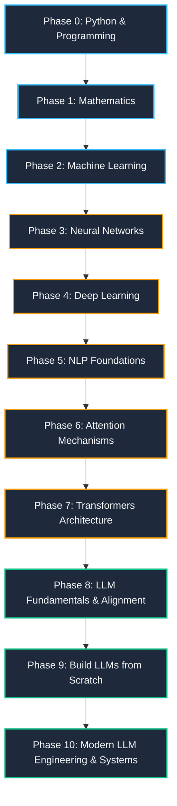

# 🧠 LLMs Journey: From Python to Large Language Models

[](https://www.python.org/)
[]()
[]()
[](LICENSE)

> **"Python to LLMs, one grounded step at a time."**  
> A structured, hands-on master curriculum and learning archive tracking the journey from programming and mathematical fundamentals to designing, implementing, and fine-tuning modern Large Language Models.

---

## 📌 Guiding Philosophy

> [!IMPORTANT]
> **Start here, not with Neural Networks.**  
> Follow the sequence: **Python → Basic Math → Linear Algebra → Probability → Calculus → Machine Learning → Neural Networks**.  
> *Skipping the mathematics makes Attention mechanisms and Transformers feel like magic instead of mechanics.*

---

## 🗺️ Roadmap Architecture



---

## 📊 Phase Overview

| Phase | Title | Difficulty | Goal | Status |
| :---: | :--- | :---: | :--- | :---: |
| **0** | **Python & Programming** | ★★★☆☆ | Comfortably write clean, idiomatic Python programs | 🟡 *In Progress* |
| **1** | **Mathematics** | ★★★★☆ | Algebra through calculus — the language ML is written in | ⚪ *Planned* |
| **2** | **Machine Learning** | ★★★★☆ | Understand how models learn representations from data | ⚪ *Planned* |
| **3** | **Neural Networks** | ★★★★★ | The foundational building blocks of deep learning | ⚪ *Planned* |
| **4** | **Deep Learning** | ★★★★★ | Trace RNN limitations that motivated attention | ⚪ *Planned* |
| **5** | **Natural Language Processing (NLP)** | ★★★★☆ | Transform raw text into mathematical representations | ⚪ *Planned* |
| **6** | **Attention Mechanisms** | ★★★★★ | Master sequence-to-sequence attention and self-attention | ⚪ *Planned* |
| **7** | **Transformers** | ★★★★★ | Deconstruct the architecture powering modern LLMs | ⚪ *Planned* |
| **8** | **LLM Fundamentals** | ★★★★★ | Pretraining, fine-tuning, RLHF, and sampling dynamics | ⚪ *Planned* |
| **9** | **Build LLMs** | ★★★★★ | Implement a custom tokenizer, GPT block, and training loop | ⚪ *Planned* |
| **10** | **Modern LLM Engineering** | ★★★★★ | RAG, Agents, Quantization, LoRA, and Production Systems | ⚪ *Planned* |

---

## 📚 Detailed Curriculum Breakdown

### 🔹 Phase 0: Python & Programming
*Goal: Comfortably write modular and efficient Python code.*
- [x] **Variables & Data Types**
  - Integers, floats, strings, booleans
  - Type checking and casting
  - String concatenation & formatted string interpolation (`f-strings`)
- [ ] **Control Flow & Structures**: Conditions (`if/elif/else`), Loops (`for`, `while`), loop control statements
- [ ] **Functions & Data Structures**: First-class functions, `*args`, `**kwargs`, lists, tuples, dictionaries, sets, comprehensions
- [ ] **OOP & System Utilities**: Classes, inheritance, modular programming, exception handling (`try/except/finally`)
- [ ] **Numerical & Data Stack**: NumPy arrays & vectorization, Pandas DataFrames, data visualization with Matplotlib

---

### 🔹 Phase 1: Mathematics for AI
*Goal: Master the mathematical bedrock that underpins deep learning algorithms.*
- [ ] **Foundational Algebra**: Functions, exponents, logarithms, and asymptotic behavior
- [ ] **Linear Algebra**: Vectors, matrices, tensors, dot products, transpositions, matrix multiplications, eigenvalues & eigenvectors
- [ ] **Probability & Statistics**: Random variables, standard distributions (Gaussian, Bernoulli), mean, variance, covariance, Bayes' theorem, conditional probability
- [ ] **Multivariable Calculus**: Derivatives, partial derivatives, directional gradients, Jacobian/Hessian matrices, and the Chain Rule

---

### 🔹 Phase 2: Machine Learning Fundamentals
*Goal: Understand optimization and how machines learn patterns from empirical data.*
- [ ] **Core Concepts**: Features, target labels, loss functions, cost formulations, optimization objectives
- [ ] **Learning Paradigms**: Supervised vs. unsupervised learning, regression vs. classification
- [ ] **Model Evaluation & Generalization**: Train/validation/test splits, bias-variance tradeoff, cross-validation, overfitting/underfitting, regularization (L1/L2)
- [ ] **Canonical Algorithms**: Linear & Logistic Regression, Decision Trees, Random Forests, K-Means clustering, and Gradient Descent optimization

---

### 🔹 Phase 3: Neural Networks
*Goal: Understand biological inspirations translated to artificial neural networks.*
- [ ] **Neuron Anatomy**: Inputs, learned weights, bias terms, weighted sum, activation functions
- [ ] **Non-linear Activation Functions**: Sigmoid, Tanh, ReLU, Leaky ReLU, Softmax
- [ ] **Training Dynamics**: Forward propagation, loss computation (MSE, Cross-Entropy), analytical backpropagation via chain rule, Gradient Descent variants

---

### 🔹 Phase 4: Deep Learning & Sequence Models
*Goal: Understand recurrence and diagnose why recurrent models hit scaling walls.*
- [ ] **Deep Feed-Forward Networks**: Multi-layer perceptrons (MLPs), batch normalization, dropout, vanishing/exploding gradient problems
- [ ] **Computer Vision Foundations**: Convolutional layers, feature maps, pooling
- [ ] **Sequence Modeling**: Recurrent Neural Networks (RNNs), hidden state persistence
- [ ] **Gated Architectures & Recurrence Limits**: LSTMs, GRUs, catastrophic forgetting, bottlenecked memory, and why sequential processing failed to scale

---

### 🔹 Phase 5: Natural Language Processing (NLP)
*Goal: Bridge human linguistics and computational token tensors.*
- [ ] **Text Preprocessing & Tokenization**: Word-level, character-level, subword algorithms (Byte-Pair Encoding, WordPiece)
- [ ] **Vocabulary & Indexing**: Building vocabularies, token IDs, special tokens (`<pad>`, `<unk>`, `<s>`, `</s>`)
- [ ] **Vector Embeddings**: Word2Vec, GloVe, high-dimensional semantic spaces
- [ ] **Language Modeling Formulation**: Sequences, contextual windows, next-token prediction objectives

---

### 🔹 Phase 6: Attention Mechanisms
*Goal: Grasp the paradigm shift from recurrence to parallelized attention.*
- [ ] **Motivation**: Overcoming RNN sequential computation constraints and distance bottlenecks
- [ ] **Attention Mechanics**: Query ($Q$), Key ($K$), and Value ($V$) conceptual formulation
- [ ] **Mathematical Operations**: Scaled dot-product attention:
  $$\text{Attention}(Q, K, V) = \text{softmax}\left(\frac{QK^T}{\sqrt{d_k}}\right)V$$
- [ ] **Self-Attention vs. Cross-Attention**: Contextual weight distribution across token relationships

---

### 🔹 Phase 7: Transformers Architecture
*Goal: Deconstruct the canonical "Attention Is All You Need" blueprint.*
- [ ] **Embeddings & Coordinates**: Token embeddings + Sinusoidal / Learned Positional Encodings
- [ ] **Multi-Head Attention (MHA)**: Subspace projections and multi-perspective attention
- [ ] **Transformer Block Plumbing**: Residual connections (skip connections), Layer Normalization (Pre-LN vs. Post-LN), Feed-Forward Networks (FFN)
- [ ] **Architectural Variants**:
  - Encoder-only (e.g., BERT)
  - Decoder-only (e.g., GPT series)
  - Encoder-Decoder (e.g., T5)

---

### 🔹 Phase 8: LLM Fundamentals & Alignment
*Goal: Learn how foundation models are trained, steered, and sampled.*
- [ ] **Training Lifecycles**: Unsupervised pretraining at scale, Causal Language Modeling (CLM), compute scaling laws
- [ ] **Instruction Tuning & Alignment**: Supervised Fine-Tuning (SFT), Reinforcement Learning from Human Feedback (RLHF), DPO (Direct Preference Optimization)
- [ ] **Inference & Sampling Parameters**: Temperature scaling, Top-$k$ filtering, Top-$p$ (Nucleus) sampling, repetition penalties
- [ ] **Operational Metrics**: Context length constraints, parameter count vs. active parameters, throughput (tokens/sec)

---

### 🔹 Phase 9: Build LLMs from Scratch
*Goal: Demystify the black box by implementing a complete generative model.*
- [ ] **Custom Tokenizer**: Implementing a clean BPE tokenizer from scratch
- [ ] **Core Neural Components**: Hand-crafting Multi-Head Attention, RoPE (Rotary Position Embeddings), and Transformer blocks in PyTorch
- [ ] **Complete Model Assembly**: Assembling a miniature decoder-only GPT architecture
- [ ] **Training & Validation Loop**: Training on a curated text dataset (e.g., TinyShakespeare), tracking loss curves, generating coherent text

---

### 🔹 Phase 10: Modern LLM Engineering & Applied Systems
*Goal: Build scalable, real-world systems on top of state-of-the-art models.*
- [ ] **Prompt Engineering & Context Management**: Few-shot prompting, Chain-of-Thought (CoT), system prompts
- [ ] **RAG (Retrieval-Augmented Generation)**: Chunking strategies, dense embeddings, vector databases (Chroma, FAISS, Pinecone), hybrid search
- [ ] **Tool Use & Autonomous Agents**: Function calling schemas, ReAct framework, structured outputs
- [ ] **Efficient Fine-Tuning & Compression**: Parameter-Efficient Fine-Tuning (PEFT), LoRA, QLoRA, weight quantization (4-bit/8-bit, AWQ, GGUF)
- [ ] **Advanced Frontiers**: Mixture-of-Experts (MoE), distributed training (DeepSpeed/FSDP), long-context extrapolation, multimodal architectures

---

## 📂 Repository Organization

```text
LLMs-Journey/
├── README.md
├── Phase 0 — Python & Programming/
│   ├── Lesson 1 Variables & Data Types/
│   │   ├── 1. variable.py
│   │   └── 2. string concatenation & string interpolation.py
│   └── ...
├── Phase 1 — Mathematics/
├── Phase 2 — Machine Learning/
├── Phase 3 — Neural Networks/
├── Phase 4 — Deep Learning/
├── Phase 5 — NLP/
├── Phase 6 — Attention/
├── Phase 7 — Transformers/
├── Phase 8 — LLM Fundamentals/
├── Phase 9 — Build LLMs/
└── Phase 10 — Modern LLM Engineering/
```

---

## 🛠️ Environment Setup

```bash
# Clone the repository
git clone https://github.com/Arsalwali00/LLMs-Journey.git
cd LLMs-Journey

# Create and activate a Python virtual environment
python3 -m venv venv
source venv/bin/activate  # On Windows: venv\Scripts\activate

# Install essential dependencies (as needed per phase)
pip install numpy pandas matplotlib torch transformers
```

---

## 🤝 Progress & Notes

- All code files are written from scratch with clean, documented examples.
- Progress updates are committed regularly alongside lesson notes and reference scripts.
